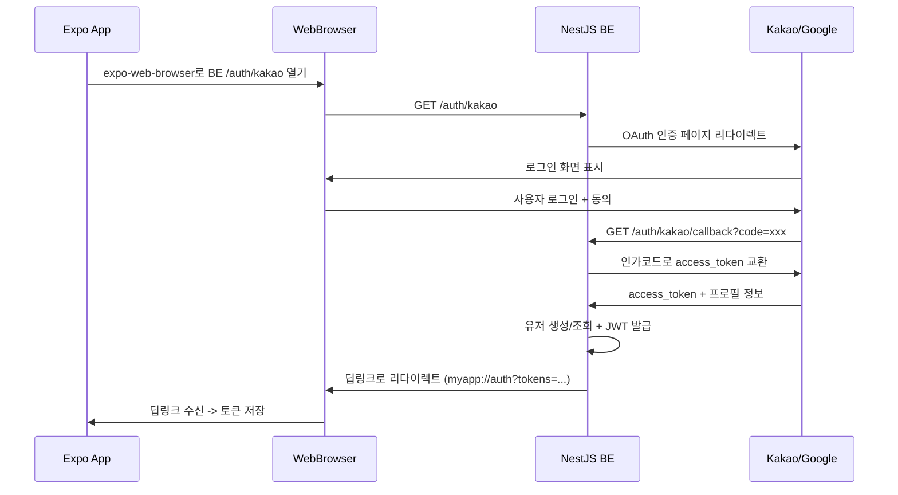

# 카카오/구글 소셜 로그인 구현 계획

## 전체 아키텍처



---

## 사전 준비 (외부 설정)

### 1. 카카오 개발자 콘솔

- [Kakao Developers](https://developers.kakao.com) 앱 생성
- **카카오 로그인 활성화** (제품 설정 > 카카오 로그인 > 활성화)
- **Redirect URI 등록**: `http://localhost:3000/auth/kakao/callback` (개발), `https://api.yourdomain.com/auth/kakao/callback` (운영)
- **동의 항목 설정**: 닉네임(필수), 이메일(선택) 등
- REST API 키, Client Secret 확보

### 2. Google Cloud Console

- [Google Cloud Console](https://console.cloud.google.com) 프로젝트 생성
- OAuth 2.0 클라이언트 ID 생성 (웹 애플리케이션 유형)
- **승인된 리다이렉트 URI**: `http://localhost:3000/auth/google/callback` (개발), `https://api.yourdomain.com/auth/google/callback` (운영)
- Client ID, Client Secret 확보
- OAuth 동의 화면 설정 (scopes: `email`, `profile`)

### 3. Expo 앱 딥링크 설정

- Expo `app.json`에 URL scheme 등록 (예: `rabbit-tracker`)
- `expo-web-browser`, `expo-linking` 패키지 사용

---

## BE 구현 계획

### 필요한 패키지

```bash
npm install @nestjs/passport @nestjs/jwt passport passport-kakao passport-google-oauth20 bcrypt
npm install -D @types/passport-kakao @types/passport-google-oauth20 @types/bcrypt
```

### 환경변수 추가 (`[.env](.env)`)

```
# 기존 DB 설정 유지 +
KAKAO_CLIENT_ID=xxx
KAKAO_CLIENT_SECRET=xxx
KAKAO_CALLBACK_URL=http://localhost:3000/auth/kakao/callback

GOOGLE_CLIENT_ID=xxx
GOOGLE_CLIENT_SECRET=xxx
GOOGLE_CALLBACK_URL=http://localhost:3000/auth/google/callback

JWT_ACCESS_SECRET=xxx
JWT_ACCESS_EXPIRES_IN=15m
JWT_REFRESH_SECRET=xxx
JWT_REFRESH_EXPIRES_IN=30d

APP_DEEP_LINK=rabbit-tracker://auth
```

### 디렉토리 구조

```
src/
  auth/
    auth.module.ts
    auth.controller.ts
    auth.service.ts
    strategies/
      kakao.strategy.ts
      google.strategy.ts
    guards/
      jwt-auth.guard.ts
      oauth.guard.ts
    decorators/
      current-user.decorator.ts
    dto/
      oauth-profile.dto.ts
  users/
    users.module.ts
    users.service.ts
```

### 핵심 모듈별 역할

#### 1. `AuthModule`

- `PassportModule`, `JwtModule` 등록
- 카카오/구글 Strategy 및 Guard 등록
- `UsersModule` import

#### 2. `AuthController` -- 엔드포인트

| Method | Path                    | 역할                                 |
| ------ | ----------------------- | ------------------------------------ |
| GET    | `/auth/kakao`           | 카카오 OAuth 시작 (리다이렉트)       |
| GET    | `/auth/kakao/callback`  | 카카오 인가코드 수신 + 처리          |
| GET    | `/auth/google`          | 구글 OAuth 시작 (리다이렉트)         |
| GET    | `/auth/google/callback` | 구글 인가코드 수신 + 처리            |
| POST   | `/auth/refresh`         | 리프레시 토큰으로 액세스 토큰 재발급 |
| POST   | `/auth/logout`          | 세션 삭제 (리프레시 토큰 무효화)     |

#### 3. `AuthService` -- 핵심 로직

```
validateOAuthLogin(profile: OAuthProfileDto)
  1. user_auth_providers에서 (provider, providerUserId)로 조회
  2-a. 존재하면 -> 해당 user 반환
  2-b. 없으면 -> users 생성 + user_auth_providers 생성 (트랜잭션)
  3. JWT 액세스 토큰 + 리프레시 토큰 생성
  4. user_sessions에 리프레시 토큰 해시 저장
  5. 토큰 반환
```

#### 4. Passport Strategies

`**kakao.strategy.ts**`: `passport-kakao` Strategy 확장

- 카카오에서 받는 프로필: `id`, `properties.nickname`, `kakao_account.email`

`**google.strategy.ts**`: `passport-google-oauth20` Strategy 확장

- 구글에서 받는 프로필: `id`, `displayName`, `emails[0].value`

두 Strategy 모두 validate()에서 통일된 `OAuthProfileDto`로 변환:

```typescript
interface OAuthProfileDto {
  provider: "kakao" | "google";
  providerUserId: string;
  email: string | null;
  nickname: string;
  avatarUrl: string | null;
}
```

#### 5. JWT + 리프레시 토큰 전략

- **액세스 토큰**: 15분 만료, payload에 `{ sub: userId, type: 'access' }`
- **리프레시 토큰**: 30일 만료, payload에 `{ sub: userId, sessionId, type: 'refresh' }`
- 리프레시 토큰은 bcrypt 해시 후 `user_sessions` 테이블에 저장
- **토큰 갱신 시 Rotation**: 새 리프레시 토큰 발급 + 기존 세션 업데이트

#### 6. 콜백 -> 딥링크 리다이렉트

콜백 처리 후 Expo 앱으로 돌아가는 방식:

```
302 Redirect -> rabbit-tracker://auth?accessToken=xxx&refreshToken=xxx&isNewUser=true
```

- `isNewUser` 플래그로 FE에서 온보딩 분기 처리

#### 7. `JwtAuthGuard` (보호 라우트용)

- `@UseGuards(JwtAuthGuard)` 데코레이터로 인증 필요 API 보호
- `@CurrentUser()` 커스텀 데코레이터로 요청에서 유저 정보 추출

#### 8. `UsersModule` / `UsersService`

- `TypeOrmModule.forFeature([User, UserAuthProvider, UserSession])` 등록
- `findByProvider()`, `createWithProvider()`, `findById()` 등 메서드

---

## 주의사항 및 고려할 점

### 보안

- **리프레시 토큰은 반드시 해시 저장** (bcrypt) -- DB 유출 시 토큰 사용 방지
- **CSRF 방지**: OAuth state 파라미터 사용 (Passport가 자동 처리하지만 검증 필요)
- **딥링크에 토큰 노출**: URL fragment(`#`) 대신 query parameter 사용 시, 앱에서 즉시 토큰을 저장하고 URL 히스토리에서 제거
- **토큰 만료 처리**: 액세스 토큰 만료 시 리프레시 -> 리프레시도 만료 시 재로그인

### 계정 연동

- **동일 이메일 다중 provider**: 카카오로 가입한 유저가 같은 이메일의 구글로 로그인 시
  - 옵션 A: 자동 연동 (같은 users 레코드에 user_auth_providers 추가)
  - 옵션 B: 별도 계정으로 처리
  - **권장**: 이메일 기반 자동 연동 (단, 이메일이 verified인 경우만)

### Expo 특이사항

- `expo-web-browser`의 `WebBrowser.openAuthSessionAsync()` 사용
- 완료 후 자동으로 앱으로 돌아옴 (딥링크 수신)
- iOS에서 `ASWebAuthenticationSession`, Android에서 `Custom Tabs` 사용됨

### DB 마이그레이션

- 현재 엔티티 파일은 존재하지만 `synchronize: false`이므로 마이그레이션 필요
- `user_auth_providers`, `user_sessions` 테이블이 이미 마이그레이션에 포함되어 있는지 확인 필요

### 에러 처리

- OAuth 실패 시 (사용자 취소, provider 에러) 딥링크에 에러 코드 전달
  - `rabbit-tracker://auth?error=cancelled`
  - `rabbit-tracker://auth?error=provider_error`

---

## 기존 코드와의 연결

- 엔티티: 이미 `[src/entities/user.entity.ts](src/entities/user.entity.ts)`, `[src/entities/user-auth-provider.entity.ts](src/entities/user-auth-provider.entity.ts)`, `[src/entities/user-session.entity.ts](src/entities/user-session.entity.ts)` 존재
- `[src/app.module.ts](src/app.module.ts)`에 `AuthModule`, `UsersModule` import 추가 필요
- `autoLoadEntities: true` 설정이 있으므로 `TypeOrmModule.forFeature()`에 등록하면 자동 인식
