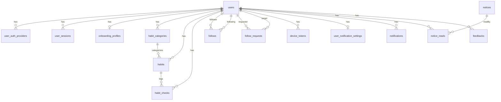

# Rabbit Tracker DB Schema

## 설계 전제

| 항목 | 결정 |
|------|------|
| DB | PostgreSQL 16 |
| ORM | TypeORM (decorator 기반) |
| PK | UUID (`gen_random_uuid()`) |
| 날짜 | **모든 날짜/시간 컬럼 `TIMESTAMPTZ` 통일** |
| 네이밍 | 컬럼: `snake_case`, 엔티티 속성: `camelCase` |
| 공통 컬럼 | `created_at`, `updated_at`, 필요 시 `deleted_at` |
| 인증 | 카카오 / 구글 / Apple 소셜 로그인 |
| 팔로우 | 하이브리드 (공개=일방, 비공개=요청/수락) |
| 동기화 | 서버 우선 |
| 알림 | FCM 기반 서버 푸시 |
| 1차 범위 | 습관 CRUD+체크, 친구/팔로우, 알림/공지 (AI는 2차) |

### 피드백 반영 사항

- `categories.color` 제거 — icon/name으로 충분
- `habits.color` 제거 — FE에서 icon/category 기반 자동 매핑
- `habit_checks.is_modified`, `modified_at` 제거 — `updated_at`으로 추론 가능
- `notifications.is_read` 제거 — `read_at`만으로 미읽음 판별 (`NULL` = 미읽음)
- 모든 날짜 컬럼 `TIMESTAMPTZ` 통일 (`DATE` 미사용)
  - `habit_checks.check_date`는 해당 날짜 `00:00:00+09` 저장
  - 유니크 제약은 `::date` 캐스팅 함수 인덱스로 보장

---

## ERD 개요

```
users
 ├── user_auth_providers     (1:N - 소셜 로그인)
 ├── user_sessions           (1:N - 리프레시 토큰)
 ├── onboarding_profiles     (1:1)
 ├── habit_categories        (1:N)
 │    └── habits             (N:1)
 │         ├── habit_checks  (1:N)
 │         └── habit_notifications (1:N)
 ├── follows                 (N:N self)
 ├── follow_requests         (N:N self)
 ├── device_tokens           (1:N)
 ├── notifications           (1:N)
 ├── user_notification_settings (1:1)
 ├── notice_reads            (1:N)
 └── feedbacks               (1:N)

notices              (독립 - 관리자용)
notification_templates (독립 - 알림 템플릿)
faqs                 (독립 - FAQ)
```

---

## 1. Auth / Core 도메인

### 1-1. `users`

```ts
@Entity({ name: 'users' })
export class User {
  @PrimaryGeneratedColumn('uuid')
  id: string;

  @Column({ type: 'varchar', length: 30 })
  nickname: string;

  @Column({ type: 'varchar', length: 255, nullable: true })
  email: string | null;

  @Column({ type: 'text', nullable: true })
  avatarUrl: string | null;

  @Column({ type: 'varchar', length: 10, nullable: true })
  avatarEmoji: string | null;

  @Column({ type: 'boolean', default: false })
  isPrivate: boolean;

  @Column({ type: 'varchar', length: 20, default: 'active' })
  status: string; // 'active' | 'suspended' | 'deleted'

  @Column({ type: 'varchar', length: 50, default: 'Asia/Seoul' })
  timezone: string;

  @CreateDateColumn({ type: 'timestamptz' })
  createdAt: Date;

  @UpdateDateColumn({ type: 'timestamptz' })
  updatedAt: Date;

  @DeleteDateColumn({ type: 'timestamptz', nullable: true })
  deletedAt: Date | null;
}
```

### 1-2. `user_auth_providers`

```ts
@Entity({ name: 'user_auth_providers' })
@Unique(['provider', 'providerUserId'])
export class UserAuthProvider {
  @PrimaryGeneratedColumn('uuid')
  id: string;

  @ManyToOne(() => User)
  @JoinColumn({ name: 'user_id' })
  user: User;

  @Column({ name: 'user_id', type: 'uuid' })
  userId: string;

  @Column({ type: 'varchar', length: 10 })
  provider: string; // 'kakao' | 'google' | 'apple'

  @Column({ type: 'varchar', length: 255 })
  providerUserId: string;

  @Column({ type: 'varchar', length: 255, nullable: true })
  email: string | null;

  @CreateDateColumn({ type: 'timestamptz' })
  createdAt: Date;
}
```

**인덱스:** `idx_auth_provider(provider, provider_user_id)`

### 1-3. `user_sessions`

```ts
@Entity({ name: 'user_sessions' })
export class UserSession {
  @PrimaryGeneratedColumn('uuid')
  id: string;

  @ManyToOne(() => User)
  @JoinColumn({ name: 'user_id' })
  user: User;

  @Column({ name: 'user_id', type: 'uuid' })
  userId: string;

  @Column({ type: 'varchar', length: 255 })
  refreshTokenHash: string;

  @Column({ type: 'varchar', length: 255, nullable: true })
  userAgent: string | null;

  @Column({ type: 'timestamptz' })
  expiresAt: Date;

  @Column({ type: 'timestamptz' })
  lastUsedAt: Date;

  @CreateDateColumn({ type: 'timestamptz' })
  createdAt: Date;
}
```

### 1-4. `onboarding_profiles`

```ts
@Entity({ name: 'onboarding_profiles' })
export class OnboardingProfile {
  @PrimaryGeneratedColumn('uuid')
  id: string;

  @OneToOne(() => User)
  @JoinColumn({ name: 'user_id' })
  user: User;

  @Column({ name: 'user_id', type: 'uuid', unique: true })
  userId: string;

  @Column({ type: 'varchar', length: 20 })
  lifestyle: string; // 'morning' | 'evening' | 'flexible'

  @Column({ type: 'varchar', length: 20 })
  ageRange: string; // '10대' | '20대 초반' 등

  @Column({ type: 'varchar', length: 30 })
  jobCategory: string; // '학생' | '개발자' 등

  @Column({ type: 'varchar', length: 50, nullable: true })
  jobText: string | null;

  @Column({ type: 'text', array: true })
  interests: string[]; // ['운동', '건강', '자기계발']

  @Column({ type: 'varchar', length: 200 })
  purposeText: string;

  @Column({ type: 'varchar', length: 10 })
  difficulty: string; // 'easy' | 'medium' | 'hard'

  @CreateDateColumn({ type: 'timestamptz' })
  createdAt: Date;

  @UpdateDateColumn({ type: 'timestamptz' })
  updatedAt: Date;
}
```

---

## 2. Habit / Category 도메인

### 2-1. `habit_categories`

```ts
@Entity({ name: 'habit_categories' })
export class HabitCategory {
  @PrimaryGeneratedColumn('uuid')
  id: string;

  @ManyToOne(() => User)
  @JoinColumn({ name: 'user_id' })
  user: User;

  @Column({ name: 'user_id', type: 'uuid' })
  userId: string;

  @Column({ type: 'varchar', length: 50 })
  name: string;

  @Column({ type: 'varchar', length: 10, nullable: true })
  icon: string | null; // emoji

  @Column({ type: 'varchar', length: 10, default: 'private' })
  visibility: string; // 'private' | 'friends' | 'public'

  @Column({ type: 'int', default: 0 })
  sortOrder: number;

  @CreateDateColumn({ type: 'timestamptz' })
  createdAt: Date;

  @UpdateDateColumn({ type: 'timestamptz' })
  updatedAt: Date;

  @DeleteDateColumn({ type: 'timestamptz', nullable: true })
  deletedAt: Date | null;
}
```

**인덱스:** `idx_categories_user(user_id)`

### 2-2. `habits`

```ts
@Entity({ name: 'habits' })
export class Habit {
  @PrimaryGeneratedColumn('uuid')
  id: string;

  @ManyToOne(() => User)
  @JoinColumn({ name: 'user_id' })
  user: User;

  @Column({ name: 'user_id', type: 'uuid' })
  userId: string;

  @ManyToOne(() => HabitCategory, { nullable: true })
  @JoinColumn({ name: 'category_id' })
  category: HabitCategory | null;

  @Column({ name: 'category_id', type: 'uuid', nullable: true })
  categoryId: string | null;

  @Column({ type: 'varchar', length: 100 })
  name: string;

  @Column({ type: 'text', nullable: true })
  description: string | null;

  @Column({ type: 'varchar', length: 10 })
  frequency: string; // 'daily' | 'weekly' | 'once' | 'custom'

  @Column({ type: 'int', nullable: true })
  frequencyDetail: number | null; // 주 N회

  @Column({ type: 'int', array: true, nullable: true })
  selectedDays: number[] | null; // [0,1,2,3,4,5,6]

  @Column({ type: 'text', array: true, default: '{}' })
  notificationTimes: string[]; // ['09:00', '21:00']

  @Column({ type: 'timestamptz' })
  startDate: Date;

  @Column({ type: 'varchar', length: 10, nullable: true })
  icon: string | null; // emoji

  @Column({ type: 'varchar', length: 10, default: 'active' })
  status: string; // 'active' | 'archived'

  @Column({ type: 'timestamptz', nullable: true })
  archivedAt: Date | null;

  @CreateDateColumn({ type: 'timestamptz' })
  createdAt: Date;

  @UpdateDateColumn({ type: 'timestamptz' })
  updatedAt: Date;

  @DeleteDateColumn({ type: 'timestamptz', nullable: true })
  deletedAt: Date | null;
}
```

**인덱스:**
- `idx_habits_user(user_id)`
- `idx_habits_user_status(user_id, status)`

### 2-3. `habit_checks`

```ts
@Entity({ name: 'habit_checks' })
export class HabitCheck {
  @PrimaryGeneratedColumn('uuid')
  id: string;

  @ManyToOne(() => Habit)
  @JoinColumn({ name: 'habit_id' })
  habit: Habit;

  @Column({ name: 'habit_id', type: 'uuid' })
  habitId: string;

  @ManyToOne(() => User)
  @JoinColumn({ name: 'user_id' })
  user: User;

  @Column({ name: 'user_id', type: 'uuid' })
  userId: string; // 비정규화 (진행률 집계용)

  @Column({ type: 'timestamptz' })
  checkDate: Date; // 체크 대상 날짜 (00:00:00+09 저장)

  @Column({ type: 'boolean', default: true })
  isChecked: boolean;

  @Column({ type: 'timestamptz' })
  checkedAt: Date; // 실제 체크한 시각

  @Column({ type: 'varchar', length: 5, nullable: true })
  notificationTime: string | null; // '09:00'

  @CreateDateColumn({ type: 'timestamptz' })
  createdAt: Date;

  @UpdateDateColumn({ type: 'timestamptz' })
  updatedAt: Date;
}
```

**제약조건:**
- `CREATE UNIQUE INDEX idx_checks_habit_day ON habit_checks(habit_id, (check_date::date))` — 습관당 하루 1체크

**인덱스:**
- `idx_checks_habit_date(habit_id, check_date)`
- `idx_checks_user_date(user_id, check_date)`

---

## 3. Friends / Social 도메인

### 3-1. `follows`

```ts
@Entity({ name: 'follows' })
@Unique(['followerId', 'followingId'])
export class Follow {
  @PrimaryGeneratedColumn('uuid')
  id: string;

  @ManyToOne(() => User)
  @JoinColumn({ name: 'follower_id' })
  follower: User;

  @Column({ name: 'follower_id', type: 'uuid' })
  followerId: string; // 팔로우 하는 사람

  @ManyToOne(() => User)
  @JoinColumn({ name: 'following_id' })
  following: User;

  @Column({ name: 'following_id', type: 'uuid' })
  followingId: string; // 팔로우 받는 사람

  @CreateDateColumn({ type: 'timestamptz' })
  createdAt: Date;
}
```

**제약조건:**
- `UNIQUE(follower_id, following_id)`
- `CHECK(follower_id != following_id)`

**인덱스:**
- `idx_follows_follower(follower_id)`
- `idx_follows_following(following_id)`

### 3-2. `follow_requests`

비공개 계정(`is_private = true`)에게 팔로우 요청 시 사용.

```ts
@Entity({ name: 'follow_requests' })
@Unique(['requesterId', 'targetId'])
export class FollowRequest {
  @PrimaryGeneratedColumn('uuid')
  id: string;

  @ManyToOne(() => User)
  @JoinColumn({ name: 'requester_id' })
  requester: User;

  @Column({ name: 'requester_id', type: 'uuid' })
  requesterId: string;

  @ManyToOne(() => User)
  @JoinColumn({ name: 'target_id' })
  target: User;

  @Column({ name: 'target_id', type: 'uuid' })
  targetId: string;

  @Column({ type: 'varchar', length: 10, default: 'pending' })
  status: string; // 'pending' | 'accepted' | 'rejected'

  @CreateDateColumn({ type: 'timestamptz' })
  createdAt: Date;

  @Column({ type: 'timestamptz', nullable: true })
  respondedAt: Date | null;
}
```

**인덱스:** `idx_follow_req_target(target_id, status)`

**플로우:**
- 공개 계정 → `follows`에 바로 INSERT
- 비공개 계정 → `follow_requests` INSERT (pending) → 수락 시 `follows`로 이동

---

## 4. Notification / Push 도메인

### 4-1. `device_tokens`

```ts
@Entity({ name: 'device_tokens' })
export class DeviceToken {
  @PrimaryGeneratedColumn('uuid')
  id: string;

  @ManyToOne(() => User)
  @JoinColumn({ name: 'user_id' })
  user: User;

  @Column({ name: 'user_id', type: 'uuid' })
  userId: string;

  @Column({ type: 'text', unique: true })
  token: string; // FCM 토큰

  @Column({ type: 'varchar', length: 10 })
  platform: string; // 'ios' | 'android'

  @Column({ type: 'boolean', default: true })
  isActive: boolean;

  @CreateDateColumn({ type: 'timestamptz' })
  createdAt: Date;

  @UpdateDateColumn({ type: 'timestamptz' })
  updatedAt: Date;
}
```

**인덱스:** `idx_device_user(user_id)`

### 4-2. `notification_templates`

```ts
@Entity({ name: 'notification_templates' })
export class NotificationTemplate {
  @PrimaryGeneratedColumn('uuid')
  id: string;

  @Column({ type: 'varchar', length: 50, unique: true })
  code: string; // 'habit_reminder', 'streak_celebration' 등

  @Column({ type: 'varchar', length: 100 })
  titleTemplate: string;

  @Column({ type: 'text' })
  bodyTemplate: string;

  @CreateDateColumn({ type: 'timestamptz' })
  createdAt: Date;
}
```

### 4-3. `user_notification_settings`

```ts
@Entity({ name: 'user_notification_settings' })
export class UserNotificationSetting {
  @PrimaryGeneratedColumn('uuid')
  id: string;

  @OneToOne(() => User)
  @JoinColumn({ name: 'user_id' })
  user: User;

  @Column({ name: 'user_id', type: 'uuid', unique: true })
  userId: string;

  @Column({ type: 'boolean', default: true })
  isPushEnabled: boolean;

  @Column({ type: 'varchar', length: 5, nullable: true })
  doNotDisturbStart: string | null; // '23:00'

  @Column({ type: 'varchar', length: 5, nullable: true })
  doNotDisturbEnd: string | null; // '07:00'

  @CreateDateColumn({ type: 'timestamptz' })
  createdAt: Date;

  @UpdateDateColumn({ type: 'timestamptz' })
  updatedAt: Date;
}
```

### 4-4. `notifications`

```ts
@Entity({ name: 'notifications' })
export class Notification {
  @PrimaryGeneratedColumn('uuid')
  id: string;

  @ManyToOne(() => User)
  @JoinColumn({ name: 'user_id' })
  user: User;

  @Column({ name: 'user_id', type: 'uuid' })
  userId: string;

  @Column({ type: 'varchar', length: 20 })
  type: string; // 'scheduled' | 'reminder' | 'celebration' | 'system'

  @Column({ type: 'varchar', length: 200 })
  title: string;

  @Column({ type: 'text', nullable: true })
  body: string | null;

  @Column({ type: 'uuid', nullable: true })
  habitId: string | null;

  @Column({ type: 'uuid', nullable: true })
  noticeId: string | null; // system 타입일 때

  @Column({ type: 'timestamptz', nullable: true })
  readAt: Date | null; // NULL=미읽음, NOT NULL=읽음

  @Column({ type: 'timestamptz' })
  sentAt: Date;

  @CreateDateColumn({ type: 'timestamptz' })
  createdAt: Date;
}
```

**인덱스:**
- `idx_noti_user(user_id, sent_at DESC)`
- `idx_noti_unread(user_id) WHERE read_at IS NULL` (partial index)

---

## 5. Notice / Settings / Feedback 도메인

### 5-1. `notices`

```ts
@Entity({ name: 'notices' })
export class Notice {
  @PrimaryGeneratedColumn('uuid')
  id: string;

  @Column({ type: 'varchar', length: 200 })
  title: string;

  @Column({ type: 'text' })
  content: string;

  @Column({ type: 'boolean', default: false })
  isPublished: boolean;

  @Column({ type: 'boolean', default: false })
  isPinned: boolean;

  @Column({ type: 'timestamptz', nullable: true })
  publishedAt: Date | null;

  @CreateDateColumn({ type: 'timestamptz' })
  createdAt: Date;

  @UpdateDateColumn({ type: 'timestamptz' })
  updatedAt: Date;
}
```

### 5-2. `notice_reads`

```ts
@Entity({ name: 'notice_reads' })
@Unique(['noticeId', 'userId'])
export class NoticeRead {
  @PrimaryGeneratedColumn('uuid')
  id: string;

  @ManyToOne(() => Notice)
  @JoinColumn({ name: 'notice_id' })
  notice: Notice;

  @Column({ name: 'notice_id', type: 'uuid' })
  noticeId: string;

  @ManyToOne(() => User)
  @JoinColumn({ name: 'user_id' })
  user: User;

  @Column({ name: 'user_id', type: 'uuid' })
  userId: string;

  @Column({ type: 'timestamptz' })
  readAt: Date;

  @CreateDateColumn({ type: 'timestamptz' })
  createdAt: Date;
}
```

### 5-3. `faqs`

```ts
@Entity({ name: 'faqs' })
export class Faq {
  @PrimaryGeneratedColumn('uuid')
  id: string;

  @Column({ type: 'varchar', length: 150 })
  question: string;

  @Column({ type: 'text' })
  answer: string;

  @Column({ type: 'int', default: 0 })
  displayOrder: number;

  @CreateDateColumn({ type: 'timestamptz' })
  createdAt: Date;

  @UpdateDateColumn({ type: 'timestamptz' })
  updatedAt: Date;
}
```

### 5-4. `feedbacks`

```ts
@Entity({ name: 'feedbacks' })
export class Feedback {
  @PrimaryGeneratedColumn('uuid')
  id: string;

  @ManyToOne(() => User)
  @JoinColumn({ name: 'user_id' })
  user: User;

  @Column({ name: 'user_id', type: 'uuid' })
  userId: string;

  @Column({ type: 'text' })
  content: string;

  @Column({ type: 'int', nullable: true })
  rating: number | null;

  @CreateDateColumn({ type: 'timestamptz' })
  createdAt: Date;
}
```

---

## 6. ER 다이어그램



---

## 설계 결정 근거

| 결정 | 근거 |
|------|------|
| UUID PK | 분산 환경 대비, FE에서 이미 string ID 사용 |
| 모든 날짜 `TIMESTAMPTZ` | 타입 통일, PG 표준, 타임존 자동 처리 |
| `check_date` 유니크 | `::date` 캐스팅 함수 인덱스로 하루 1체크 보장 |
| PG 배열 (`interests`, `selected_days` 등) | 항상 부모와 함께 로드, 크기 작음, JOIN 불필요 |
| `follows` + `follow_requests` 분리 | 확정 관계와 대기 관계를 명확히 분리 |
| `habit_checks.user_id` 비정규화 | 친구 진행률 조회 시 habits JOIN 없이 집계 가능 |
| `onboarding_profiles` 분리 | users 테이블 경량 유지, 온보딩은 별도 라이프사이클 |
| `notifications.read_at` | `is_read` 대신 `read_at`만으로 미읽음 판별 + 읽은 시점 추적 |
| `categories.color` 제거 | icon/name으로 충분, FE에서 자동 매핑 |
| `habit_checks.is_modified` 제거 | `updated_at`으로 추론 가능 |
| `deleted_at` (soft delete) | users, categories, habits에 적용 — 실수 복구 및 데이터 보존 |
| AI 도메인 2차 | 1차 범위에서 제외, 추후 `ai_sessions`, `ai_messages` 등 추가 |

---

## 주요 쿼리 패턴

### 오늘 진행률 (친구 탭용)

```sql
SELECT
  hc.user_id,
  COUNT(DISTINCT h.id) FILTER (WHERE h.status = 'active') AS total,
  COUNT(hc.id) FILTER (WHERE hc.is_checked = true) AS completed
FROM habits h
LEFT JOIN habit_checks hc
  ON hc.habit_id = h.id
  AND hc.check_date::date = CURRENT_DATE
WHERE h.user_id = ANY($1)
  AND h.status = 'active'
  AND h.deleted_at IS NULL
GROUP BY hc.user_id;
```

### 연속 달성(Streak) 계산

```sql
WITH dates AS (
  SELECT check_date::date AS d,
         check_date::date - (ROW_NUMBER() OVER (ORDER BY check_date::date))::int AS grp
  FROM habit_checks
  WHERE habit_id = $1 AND is_checked = true
)
SELECT COUNT(*) AS current_streak
FROM dates
WHERE grp = (SELECT grp FROM dates WHERE d = CURRENT_DATE);
```
